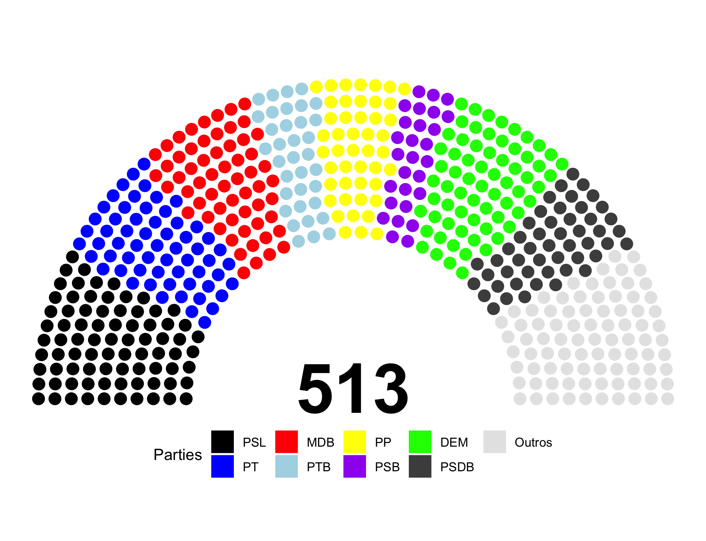

<!-- README.md is generated from README.Rmd. Please edit that file -->

```{r, echo = FALSE}
knitr::opts_chunk$set(
  collapse = TRUE,
  comment = "#>",
  fig.path = "README-"
)
```


# CamaraBR  

[](https://www.tidyverse.org/lifecycle/#experimental)
  [](https://travis-ci.org/danielmarcelino/CamaraBR)


## R package for accessing the Brazilian Chamber of Deputies RESTful API

## Installation 🤞

To get the current development version from Github:

```{r, eval=FALSE}
## install devtools package if it's not already
if (!requireNamespace("devtools", quietly = TRUE)) {
  install.packages("devtools")
}
## install dev version of CamaraBR from github
devtools::install_github("danielmarcelino/CamaraBR")
## load CamaraBR package
library(CamaraBR)
```


## Usage 🙌🚀


### Downloading proposal details 
```{r, eval=FALSE}
library(tidyverse)
library(CamaraBR)
library(progress);

anos = 1988:2020

barra <- progress_bar$new(total = length(anos), 
                          format = "[:bar] :percent eta: :eta")
      

proposals <- purrr::map_df(anos, ~{
                           barra$tick()
                           loadCamaraProposals(.x)
                           })


proposals %>% count(type_bill)

# fwrite(proposals, file = "data/proposals.txt")

# save(proposals, file = "data/proposals.rda")
```


### Downloading legislator rollcall vote details 
```{r, eval=FALSE}
library(CamaraBR)
library(progress)

anos = 2003:2020

barra <- progress_bar$new(total = length(anos), 
                          format = "[:bar] :percent eta: :eta")

 rollcall <- purrr::map_df(anos, ~{
                           barra$tick()
                           loadVotacoesCamara(.x)
                          })


rollcall %>% count(legislator_party)
```


### Downloading rollcall vote orientations

```{r, eval=FALSE}
library(CamaraBR)

anos = 2019:2020

orientation <- purrr::map_df(anos, ~{
                           loadVotacoesOrientacoesCamara(.x)
                           })


orientation %>% count(sigla_orgao)


orientation %>% count(sigla_bancada)
```


### Build a rollcall dataset

```{r, eval=FALSE}
# legacy: data <- data %>% filter(type_bill == "MPV", number_bill == 897, year_bill == 2019 )
# data <- buildRollcallDataset(year = 1999)
# 
library(CamaraBR);
library(dplyr)

data <- buildRollcallDataset(year = 2019)


# Votações válidas no ano para o nosso cálculo
data %>%
  # filter(!is.na(Governo)) %>%
  distinct(rollcall_id) %>%
  nrow()


data %>%
  filter(legislator_vote %in% c("Nao", "Obstrução","Sim")) %>%
  filter(!is.na(legislator_vote)) %>%
  count(Governo)

```


### Transform the dataset for analysis

```{r, eval=FALSE}
#vsiglaTipo = c("PEC", "PL", "PLP")


base <- transformVotes(data, filter = FALSE) # considers every plenary rollcall  

base2 <- transformVotes(data, filter = TRUE) # only considers rollcall with gov orientation


base %>%
  # filter(!is.na(Governo)) %>%
  distinct(rollcall_id) %>%
  nrow()

```


## Governismo geral
```{r, eval=FALSE}
# base %>% group_by(legislator_party) %>% summarise(n=n()) %>% data.frame()

## Governismo geral
base %>%
  group_by(rollcall_id) %>%
  summarise(governismo = mean(governismo, na.rm=T)) %>%
  summarise(governismo = mean(governismo, na.rm=T))

```


## Governismo por partido

```{r, eval=FALSE}
# Por partido
governismo_partido <- base %>%
  group_by(rollcall_id, legislator_party) %>%
  summarise(soma = sum(governismo, na.rm=TRUE),
            nao = sum(abs(-1 + governismo)),
            governismo = mean(governismo, na.rm=TRUE),
            freq = n()) %>%
# filter(legislator_party %in% c("PT", "PSDB", "PMDB","MDB", "PSL", "PP","PR","PSD", "DEM")) %>%
  group_by(legislator_party) %>%
  summarise(governismo = mean(governismo, na.rm=TRUE),
            soma = sum(soma, na.rm=TRUE),
            nao = sum(nao))

governismo_partido %>% arrange(governismo) %>% data.frame()


# Média de governismo entre os partidos
governismo_partido %>%
  summarize(mu = mean(governismo, na.rm=T),
            sd = sd(governismo, na.rm=T))
```


## Quer apresentar seus dados e não sabe como?

```{r, eval=FALSE}

library(SciencesPo)
library(ggdecor)


camara <- data.frame(
         parties = c("PSL", "PT", "MDB", "PTB", "PP", "PSB", "DEM", "PSDB", "Outros"), 
         seats   = c(80, 61, 60, 35, 46, 28, 67, 50, 86),
         stringsAsFactors = FALSE)

 ggplot(camara) +
   geom_chamber(aes(seats = seats, fill = parties), color = "black") +
   scale_fill_classic() +
   coord_fixed() +
   theme_void()

```



